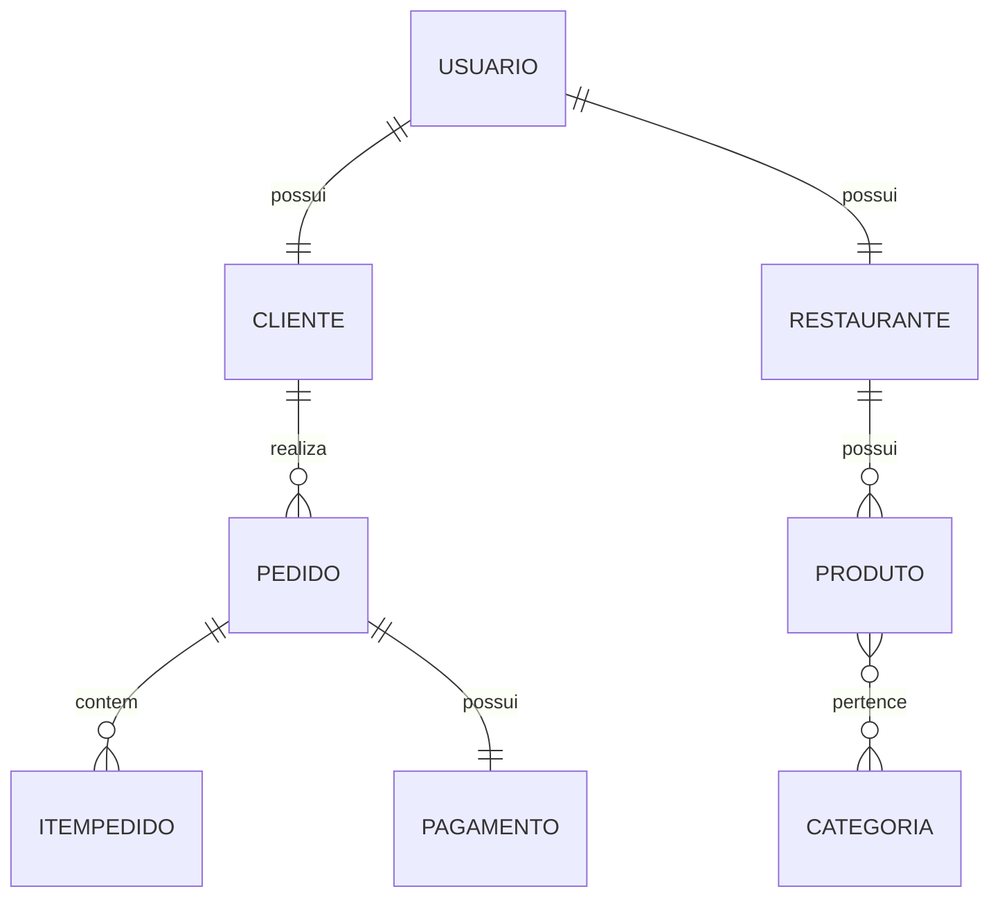

# 🍔 FoodFlow

Sistema web de delivery inspirado no modelo do iFood, permitindo que clientes realizem pedidos em restaurantes cadastrados.

---
## 👥 Desenvolvedores
- ALLYSSON MASTRÂNGELO TEIXEIRA ARAUJO DE FREITAS
- CARLOS VICTOR ARAÚJO BEZERRA ALVES 
- EDJANE MIKAELLY SILVA DE AZEVEDO

## 🚀 Sobre o Projeto

O **FoodFlow** é uma plataforma completa de delivery que conecta clientes, restaurantes e administradores, permitindo o gerenciamento de pedidos, pagamentos e avaliações em um único sistema.

---

## 👥 Perfis de Usuário

### 👤 Cliente
- Realiza pedidos  
- Acompanha entregas  
- Visualiza histórico  
- Avalia restaurantes  

### 🍽️ Restaurante
- Gerencia produtos  
- Gerencia pedidos  
- Atualiza status  
- Visualiza avaliações  

### 🛠️ Administrador
- Gerencia usuários  
- Gerencia restaurantes  
- Controla pedidos  
- Administra toda a plataforma  

---

## 🧩 Entidades do Sistema

- Usuário  
- Cliente  
- Restaurante  
- Produto  
- Categoria  
- Pedido  
- ItemPedido  
- Endereço  
- Pagamento  
- Avaliação  

---
## ⚙️ Requisitos Funcionais

### 📌 Funcionalidades Principais

- 🔐 Cadastro e autenticação de usuários com JWT  
- 🏪 Gerenciamento de restaurantes e produtos (CRUD)  
- 📋 Listagem de restaurantes disponíveis  
- 🛒 Realização de pedidos  
- 📜 Consulta ao histórico de pedidos  
- 🔁 Repetição de pedidos anteriores  
- 🚚 Atualização do status dos pedidos  
- 💳 Registro de pagamentos  
- ⭐ Avaliação de restaurantes  
- 🧑‍💼 Gerenciamento administrativo da plataforma  

---
### 📑 Especificação dos Requisitos

**RF01** – O sistema deve permitir o cadastro de usuários com informações básicas (nome, e-mail e senha).  

**RF02** – O sistema deve permitir a autenticação de usuários utilizando JSON Web Token (JWT).  

**RF03** – O sistema deve permitir a recuperação de senha por meio de e-mail.  

**RF04** – O sistema deve permitir a atualização dos dados cadastrais do usuário.  

---

### 🏪 Restaurantes e Produtos

**RF05** – O sistema deve permitir o cadastro de restaurantes.  

**RF06** – O sistema deve permitir a edição e exclusão de restaurantes.  

**RF07** – O sistema deve permitir o cadastro de produtos associados a um restaurante.  

**RF08** – O sistema deve permitir a edição e exclusão de produtos.  

**RF09** – O sistema deve permitir a associação de produtos a categorias.  

**RF10** – O sistema deve permitir a listagem de restaurantes disponíveis.  

**RF11** – O sistema deve permitir a visualização dos detalhes de um restaurante (cardápio, avaliações, etc.).  

---

### 🛒 Pedidos

**RF12** – O sistema deve permitir que o cliente adicione produtos ao carrinho.  

**RF13** – O sistema deve permitir a atualização das quantidades de itens no carrinho.  

**RF14** – O sistema deve permitir a remoção de itens do carrinho.  

**RF15** – O sistema deve permitir a finalização do pedido.  

**RF16** – O sistema deve permitir o cálculo automático do valor total do pedido.  

**RF17** – O sistema deve permitir a seleção do endereço de entrega.  

**RF18** – O sistema deve permitir a visualização do histórico de pedidos do cliente.  

**RF19** – O sistema deve permitir a repetição de pedidos anteriores.  

---

### 🚚 Entrega e Status

**RF20** – O sistema deve permitir a atualização do status do pedido (em preparo, em entrega, entregue).  

**RF21** – O sistema deve permitir que o cliente acompanhe o status do pedido em tempo real.  

---

### 💳 Pagamentos

**RF22** – O sistema deve permitir o registro de pagamentos associados aos pedidos.  

**RF23** – O sistema deve permitir diferentes formas de pagamento (ex.: Pix, cartão).  

**RF24** – O sistema deve registrar o status do pagamento (pendente, aprovado, recusado).  

---

### ⭐ Avaliações

**RF25** – O sistema deve permitir que clientes avaliem restaurantes.  

**RF26** – O sistema deve permitir a atribuição de notas e comentários.  

**RF27** – O sistema deve permitir a visualização das avaliações pelos usuários.  

---

### 🧑‍💼 Administração

**RF28** – O sistema deve permitir o gerenciamento de usuários pelo administrador.  

**RF29** – O sistema deve permitir o gerenciamento de restaurantes pelo administrador.  

**RF30** – O sistema deve permitir o gerenciamento de pedidos pelo administrador.  

**RF31** – O sistema deve permitir a visualização de relatórios básicos (ex.: pedidos realizados, faturamento).  

## 🔗 Relacionamentos

### 🔹 One-to-One
- Usuário ↔ Cliente  
- Usuário ↔ Restaurante  
- Pedido ↔ Pagamento  

### 🔹 One-to-Many
- Restaurante → Produto  
- Cliente → Pedido  
- Pedido → ItemPedido  
- Entregador → Pedidos  
- Entregador → Restaurantes  

### 🔹 Many-to-Many
- Produto ↔ Categoria  

---

## 🏗️ Modelo de Dados (DER)

## 🏗️ Arquitetura
- Back-end: API REST com Spring Boot
- Front-end: React ou HTML/CSS/JS
- Banco de Dados: H2 (dev)
- Segurança: Spring Security + JWT

## 🛠️ Tecnologias Utilizadas
- Back-end
- Java 17+
- Spring Boot
- Spring Data JPA
- Spring Security
- JWT
## 🗄️ Banco de Dados
- H2 (ambiente de desenvolvimento)
## 🎨 Front-end
- React ou
- HTML, CSS e JavaScript
## 📚 Documentação
- Swagger (OpenAPI)
