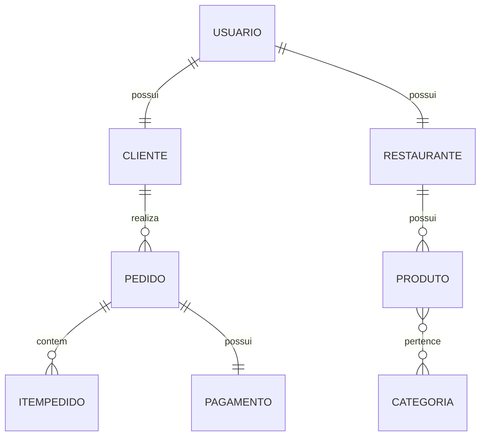

# 🍔 FoodFlow


Sistema web de delivery inspirado no modelo do iFood, permitindo que clientes realizem pedidos em restaurantes cadastrados.

---

# 🚀 Sobre o Projeto

O **FoodFlow** é uma plataforma completa de delivery que conecta clientes, restaurantes e administradores, permitindo o gerenciamento de pedidos, pagamentos e avaliações em um único sistema.

A aplicação foi desenvolvida utilizando arquitetura REST com Spring Boot, autenticação JWT e separação de responsabilidades utilizando DTOs, Services, Controllers e Repositories.

---

# 👥 Desenvolvedores

* ALLYSSON MASTRÂNGELO TEIXEIRA ARAUJO DE FREITAS
* CARLOS VICTOR ARAÚJO BEZERRA ALVES
* EDJANE MIKAELLY SILVA DE AZEVEDO

---

# 👥 Perfis de Usuário

## 👤 Cliente

* Realiza pedidos
* Acompanha entregas
* Visualiza histórico
* Avalia restaurantes

## 🍽️ Restaurante

* Gerencia produtos
* Gerencia pedidos
* Atualiza status
* Visualiza avaliações

## 🛠️ Administrador

* Gerencia usuários
* Gerencia restaurantes
* Controla pedidos
* Administra toda a plataforma

---

# ⚙️ Funcionalidades Principais

* 🔐 Cadastro e autenticação com JWT
* 🏪 CRUD de restaurantes
* 🍔 CRUD de produtos
* 📂 Gerenciamento de categorias
* 🛒 Carrinho de compras
* 📦 Controle de pedidos
* 🚚 Acompanhamento de status
* 💳 Registro de pagamentos
* ⭐ Avaliações de restaurantes
* 📊 Relatórios administrativos

---

# 🏗️ Arquitetura da Aplicação

A aplicação segue arquitetura REST com separação de responsabilidades:

* **Controllers** → exposição dos endpoints REST
* **Services** → regras de negócio
* **Repositories** → acesso ao banco de dados
* **DTOs** → comunicação da API
* **Entities** → representação das tabelas do banco

A aplicação utiliza DTOs para desacoplar totalmente as entidades do banco da interface da API.

---

# 🔐 Segurança da Aplicação

A autenticação é realizada utilizando JWT Token.

O controle de acesso utiliza:

```java
@PreAuthorize(...)
```

com permissões baseadas em roles.

## Roles disponíveis

* ADMIN
* RESTAURANTE
* CLIENTE

---

# 📋 Matriz de Permissões

| Endpoint                       | Método | ADMIN | RESTAURANTE | CLIENTE | Público |
| ------------------------------ | ------ | ----- | ----------- | ------- | ------- |
| `/info`                        | GET    | ✅     | ✅           | ✅       | ✅       |
| `/auth/login`                  | POST   | ✅     | ✅           | ✅       | ✅       |
| `/usuarios`                    | GET    | ✅     | ❌           | ❌       | ❌       |
| `/usuarios/{id}`               | GET    | ✅     | ❌           | ❌       | ❌       |
| `/usuarios/{id}`               | PUT    | ✅     | ❌           | ❌       | ❌       |
| `/usuarios/{id}`               | DELETE | ✅     | ❌           | ❌       | ❌       |
| `/restaurantes`                | GET    | ✅     | ✅           | ✅       | ✅       |
| `/restaurantes`                | POST   | ✅     | ❌           | ❌       | ❌       |
| `/restaurantes/{id}`           | GET    | ✅     | ✅           | ✅       | ✅       |
| `/restaurantes/{id}`           | PUT    | ✅     | ✅           | ❌       | ❌       |
| `/restaurantes/{id}`           | DELETE | ✅     | ❌           | ❌       | ❌       |
| `/produtos`                    | GET    | ✅     | ✅           | ✅       | ✅       |
| `/produtos`                    | POST   | ✅     | ✅           | ❌       | ❌       |
| `/produtos/{id}`               | GET    | ✅     | ✅           | ✅       | ✅       |
| `/produtos/{id}`               | PUT    | ✅     | ✅           | ❌       | ❌       |
| `/produtos/{id}`               | DELETE | ✅     | ✅           | ❌       | ❌       |
| `/categorias`                  | GET    | ✅     | ✅           | ✅       | ✅       |
| `/categorias`                  | POST   | ✅     | ❌           | ❌       | ❌       |
| `/categorias/{id}`             | PUT    | ✅     | ❌           | ❌       | ❌       |
| `/categorias/{id}`             | DELETE | ✅     | ❌           | ❌       | ❌       |
| `/pedidos`                     | GET    | ✅     | ✅           | ✅       | ❌       |
| `/pedidos`                     | POST   | ❌     | ❌           | ✅       | ❌       |
| `/pedidos/{id}`                | GET    | ✅     | ✅           | ✅       | ❌       |
| `/pedidos/{id}/status`         | PUT    | ✅     | ✅           | ❌       | ❌       |
| `/pagamentos`                  | GET    | ✅     | ❌           | ❌       | ❌       |
| `/pagamentos`                  | POST   | ✅     | ❌           | ✅       | ❌       |
| `/pagamentos/{id}`             | GET    | ✅     | ❌           | ✅       | ❌       |
| `/avaliacoes`                  | POST   | ❌     | ❌           | ✅       | ❌       |
| `/avaliacoes/restaurante/{id}` | GET    | ✅     | ✅           | ✅       | ✅       |
| `/admin/relatorios`            | GET    | ✅     | ❌           | ❌       | ❌       |

---

# 🧩 Entidades do Sistema

* Usuário
* Cliente
* Restaurante
* Produto
* Categoria
* Pedido
* ItemPedido
* Endereço
* Pagamento
* Avaliação

---

# 🔗 Relacionamentos

## 🔹 One-to-One

* Usuário ↔ Cliente
* Usuário ↔ Restaurante
* Pedido ↔ Pagamento

## 🔹 One-to-Many

* Restaurante → Produto
* Cliente → Pedido
* Pedido → ItemPedido

## 🔹 Many-to-Many

* Produto ↔ Categoria

---

# 🏗️ Modelo de Dados (DER)



---

# 🛠️ Tecnologias Utilizadas

## Back-end

* Java 17
* Spring Boot
* Spring Security
* Spring Data JPA
* JWT Authentication
* Bean Validation

## Banco de Dados

* PostgreSQL
* H2 (desenvolvimento)

## Front-end

* Flutter
* React
* HTML/CSS/JavaScript

## Documentação

* Swagger OpenAPI

---

# 📦 Endpoints Principais

## Público

```http
GET /info
```

---

## Autenticação

```http
POST /auth/login
```

### Request

```json
{
  "username": "admin",
  "password": "123456"
}
```

### Response

```json
{
  "token": "jwt_token_aqui"
}
```

---

## Clientes

```http
GET /clientes
POST /clientes
GET /clientes/{id}
PUT /clientes/{id}
DELETE /clientes/{id}
```

---

## Restaurantes

```http
GET /restaurantes
POST /restaurantes
GET /restaurantes/{id}
PUT /restaurantes/{id}
DELETE /restaurantes/{id}
```

---

## Produtos

```http
GET /produtos
POST /produtos
GET /produtos/{id}
PUT /produtos/{id}
DELETE /produtos/{id}
```

---

## Pedidos

```http
GET /pedidos
POST /pedidos
GET /pedidos/{id}
PUT /pedidos/{id}
```

---

# 📚 DTOs e Validação

A aplicação não expõe diretamente as entidades do banco de dados.

As entidades representam a estrutura persistida no banco, enquanto os DTOs controlam os dados enviados e recebidos pela API.

## Exemplo de validações

```java
@NotBlank
@Email
@NotNull
@Size
```

Essas validações garantem integridade dos dados recebidos pela API.

---

# 📊 Status HTTP Utilizados

| Status           | Descrição                        |
| ---------------- | -------------------------------- |
| 200 OK           | Requisição realizada com sucesso |
| 201 Created      | Recurso criado com sucesso       |
| 204 No Content   | Recurso removido com sucesso     |
| 400 Bad Request  | Dados inválidos                  |
| 401 Unauthorized | Usuário não autenticado          |
| 403 Forbidden    | Usuário sem permissão            |
| 404 Not Found    | Recurso não encontrado           |

---

# 📮 Collection Postman

A aplicação possui collection Postman contendo todos os endpoints da API com autenticação JWT automatizada.

---

# ▶️ Execução do Projeto

## Clonar repositório

```bash
git clone https://github.com/SEU_REPOSITORIO.git
```

## Executar aplicação

```bash
./mvnw spring-boot:run
```

---

# 📖 Documentação Swagger

```http
http://localhost:8080/swagger-ui.html
```

---

# 📌 Status do Projeto

🚧 Em desenvolvimento

---

# 📄 Licença

Projeto desenvolvido para fins acadêmicos.
